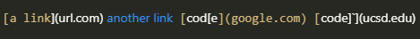
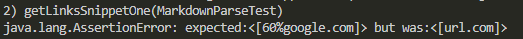
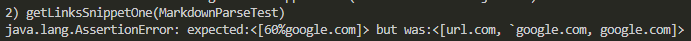
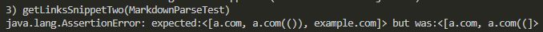
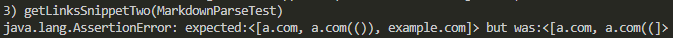
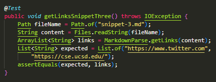
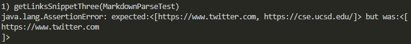
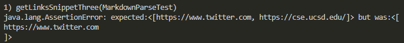

# Lab Report 4
[Main Page](https://hsflores7.github.io/cse15l-lab-reports/index.html)

[My Markdown Repo](https://github.com/hsflores7/markdown-parser)

[Other Group Markdown Repo](https://github.com/ehsly/markdown-parser)

## Snippet 1
### Expected

There is 1 link: `another link`

**MarkdownParse:** [60%google.com]

### Tester
Gets the path of file, then it reads the file. Then it runs the getLinks method 
on the file. Following that it makes a list of the expected output. Then tests 
if they are equivalent

### My Repo Output

### Their Repo Output

### Fix
The main problems arrises when the back ticks are used. So creating method to 
deal with the code blocks. We would want to ignore anything in a code block.
So creating a method that removes actual code segments/block from the getLinks 
method, being careful to no remove ones like the [another link](`google.com)` 
example because it doesn't actually function as a code segment because of the 
brackets.

## Snippet 2
### Expected

There are 3 links: `nested link`, `a nested paranthesized url`, and `some escaped [ bracket ]`

**MarkdownParse:** [a.com, a.com(()), example.com]

### Tester
Gets the path of file, then it reads the file. Then it runs the getLinks method 
on the file. Following that it makes a list of the expected output. Then tests 
if they are equivalent

### My Repo Output

### Their Repo Output

### Fix
The main problem with snippet 2 is the parantheses inside the link, which we 
would need to include a way to deal with the parantheses within the link by 
either counting them the way markdown likely does (with a stack data
structure) in order to keep track of the parentheses.

## Snipet 3
### Expected

There is 3 links: `this title text is really long and takes up more than one line and has some line breaks`, `https://sites.google.com/eng.ucsd.edu/cse-15l-spring-2022/schedu` (this one doesn't use the markdown formatting it's just a link), `this link doesn't have a closing parenthesis for a while` 

**MarkdownParse:** [https://www.twitter.com, https://cse.ucsd.edu/]

### Tester
Gets the path of file, then it reads the file. Then it runs the getLinks method 
on the file. Following that it makes a list of the expected output. Then tests 
if they are equivalent

### My Repo Output

### Their Repo Output

### Fix
The main problems is dealing with new lines (\n) so when creating the list of
links it should not allow for new line charaters. Long with a way to ensure
that the problem with the cse link is solved as well and read as a link. That 
problem probably arrises because of the github link doesn't have a end parantheses
which throws everything off for the rest of the file so a way to reset in case 
of a mistype like this.