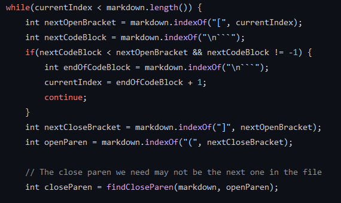

# Lab Report 5
[Main Page](https://hsflores7.github.io/cse15l-lab-reports/index.html)

### Finding the difference between them?
I used `vimdiff` to find the differences between the file's results. 

### Link to the test-file
* [Test File 194](https://github.com/nidhidhamnani/markdown-parser/edit/main/test-files/194.md)
* [Test File 507](https://github.com/nidhidhamnani/markdown-parser/edit/main/test-files/507.md)

## Test-File 1
### Which implementation is correct?
Neither are correct. 

### Actual Outputs
* On the left is my markdown and on the right is the other markdown

### Expected Output
* It has a link to `my_(url)`. So the expected output should be: `[my_(url)]`

### Bug
* My implementation and the other implementation does take care into account the 
other form a link can be in. They only account for the `` style. So hence,
the `[]` and `[url]` outcomes. And the reason they have the `[url]` is because 
the parser looks at when the `` occur and the "url" is in the parantheses

* Need to add a function that looks for the other for of links

## Test File 2
### Which implementation is correct?
* My parser is not correct and the others one is correct.

### Actual Outputs
* On the left is my markdown and on the right is the other markdown

### Expected Output
* There are no links so the expected output is `[]`

### Bug
* My implementation doesn't work because it does remove it form the the possible
links. That is to say this is an invalid link but it doesn't remove it as an 
invalid link.

* Adding more filters to remove invalid links.
